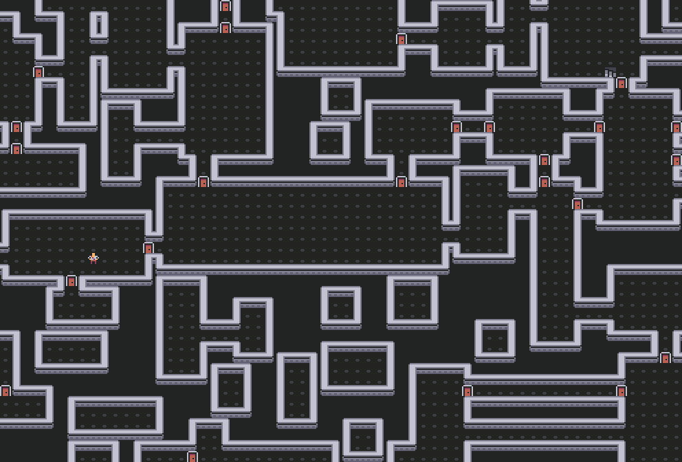

# Rogue-like template

Kotlin rogue-like template built on top of [Zircon](https://github.com/Hexworks/zircon).

The goal of this project is to provide a simple starting point for prototyping a rogue-like game in about
1 or 2 days.

As such, it doesn't (yet?) use an [ECS](https://en.wikipedia.org/wiki/Entity_component_system) /
[SEA](https://github.com/Hexworks/amethyst) system, which you
[probably want to use](https://www.youtube.com/watch?v=U03XXzcThGU) for bigger projects.

It shall eventually be multiplatform, but currently only JVM build is functional.

### Prerequisites

Java 8+.

## Running

The whole project features the Gradle build-system with several simple-to-use tasks in the `custom` group.

These include:
 - `renderPng` - renders the first level into `out/render.png`
 - `playGame` - launches the game on JVM
 - `shadowJar` - will build a runnable JAR into `build/libs/roguelike-<version>-all.jar`

## Documentation

Check out the [wiki](https://gitlab.com/gamedev-cuni-cz/pcg/roguelike/-/wikis/home).

## Wave Function Collapse

[Wave Function Collapse](https://github.com/mxgmn/WaveFunctionCollapse) (Kotlin port by
[Jakub Mifek](https://github.com/JakubMifek/WFC-Kotlin)) is a part of this repository.
It can be used as a simple level generator with creations such as this:

## License

This project is licensed under the terms of the [MIT license](./LICENSE).

[Zircon](https://github.com/Hexworks/zircon) is licensed under the [Apache 2.0 license](./LICENSE.apache).
